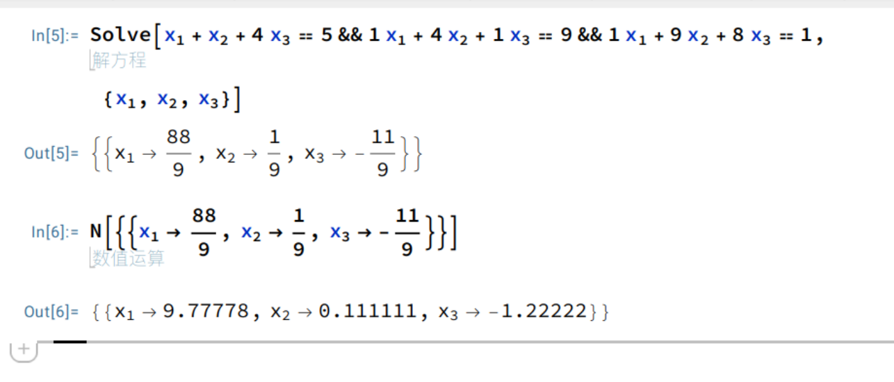

# 一个解线性方程组的玩意


输入未知数个数 再按提示输入增广矩阵即可

如下对应

$$
\begin{array}{rcrcrcl}
x_1 & + & x_2 & + & 4x_3 & = & 5 \\
x_1 & + & 4x_2 & + & x_3 & = & 9 \\
x_1 & + & 9x_2 & + & 8x_3 & = & 1
\end{array}
\quad \Rightarrow \quad
\begin{array}{rcr}
x_1 & = & 9.778 \\
x_2 & = & 0.111 \\
x_3 & = & -1.222
\end{array}
$$



```
$ cargo run --release
请输入一个整数 n:
3
请输入增广矩阵的每一行（用空格分隔，每行 4 个数）:
1 1 4 5
1 4 1 9 
1 9 8 1
结果: Vec<f64> [
  9.777777777777779,
  0.1111111111111111,
  -1.2222222222222223,
]

```
